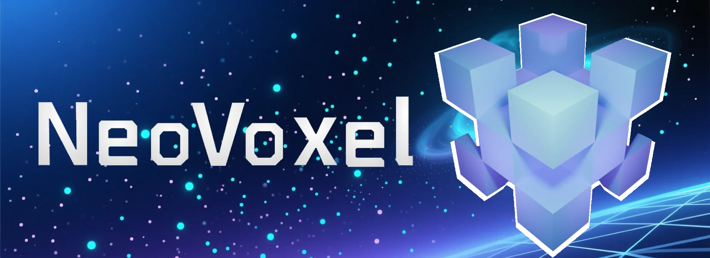

### NeoBot：连接 Minecraft 与多平台的桥梁

**NeoBot** 是由 *NeoVoxel Team* 开发的一款将 `Minecraft` 与 `QQ`、`Discord`、`Telegram`、`Kook` 等平台连接的插件。  
NeoBot 旨在为服务器管理员和玩家提供卓越的体验，实现游戏内外的无缝通信。

**NeoBot 仓库**: [NeoVoxelDev/NeoBot](https://github.com/NeoVoxelDev/NeoBot)
**NeoBot 文档**: [NeoBot 官方文档](https://neobot-docs.netlify.app/)

### 🎯 核心功能
- ✅ **多平台支持** - 支持 QQ、Discord、Telegram、Kook 等主流聊天平台
- ✅ **双向通信** - 实现游戏内外的消息同步和交互
- ✅ **脚本系统** - 提供强大的脚本 API，支持自定义功能扩展
- ✅ **灵活配置** - 丰富的配置选项，满足不同服务器需求
- ✅ **社区脚本库** - 活跃的社区贡献，提供丰富的扩展脚本
- ✅ **多语言支持** - 支持中英文界面和消息定制

---

## ⭐ 点个 Star 支持我们

如果您觉得 NeoBot 有用，请在 GitHub 上给我们一个 Star，这将帮助我们获得更多关注并推动项目发展。

**💬 加入我们的交流群:** [QQ 交流群](https://qm.qq.com/q/V0grgmFQ4y)

---

## 🚀 快速开始

### 前提条件

- Java 运行环境：Java 17 或更高版本
- 已准备可运行的 Minecraft 服务端（Paper、Leaves 等）
- 拥有服务端文件夹的读写权限和重启/启动服务端的能力

### 安装步骤

1. **下载插件**
   - 从 [Releases 页面](https://github.com/NeoVoxelDev/NeoBot/releases) 下载最新版本的 NeoBot 插件 JAR 文件。

2. **安装插件**
   - 将插件 JAR 文件复制到服务端的 `plugins` 文件夹中。

3. **启动服务端**
   - 启动或重启 Minecraft 服务端，让插件生成默认配置文件。

4. **配置插件**
   - 编辑 `plugins/NeoBot/config.json` 文件，配置相应的平台对接信息。

5. **测试功能**
   - 检查插件是否正常加载，测试基础功能如消息发送等。

详细安装指南请参考：[快速开始文档](https://neobot-docs.netlify.app/quick-started)

---

## ✨ 主要特性

### 🔗 多平台连接
支持与多个主流聊天平台的连接，实现游戏内外的消息互通：
- QQ（通过 OneBot11 协议）
- Discord
- Telegram
- Kook（原开黑啦）

### 🔌 脚本系统
提供强大的 JavaScript 脚本 API，支持开发者创建自定义功能：
- 事件监听和处理
- 消息自定义和过滤
- 数据库操作支持
- 游戏内命令扩展

### 🗂️ 社区脚本库
丰富的社区贡献脚本，可直接使用或作为开发参考：
- [官方脚本集合](https://neobot-docs.netlify.app/config/scripts/neovoxel-scripts)
- [社区脚本仓库](https://neobot-docs.netlify.app/config/scripts/community-scripts/repo)
- [脚本上传指南](https://neobot-docs.netlify.app/config/scripts/upload-scripts)

### ⚙️ 灵活配置
提供丰富的配置选项，满足不同服务器的个性化需求：
- 主配置文件：`config.json`
- 消息配置文件：`messages.json`
- 多语言支持

### 📄 完整文档
提供详细的文档和 API 参考，帮助用户和开发者快速上手：
- [用户指南](https://neobot-docs.netlify.app/)
- [API 文档](https://neobot-docs.netlify.app/config/scripts/neobot)
- [贡献指南](https://neobot-docs.netlify.app/contribution/contribution)

---

## 🛠️ 技术栈

- **文档平台**: [VitePress](https://vitepress.dev/)

---

## 🤝 贡献

我们欢迎任何形式的贡献！如果您想为 NeoBot 做出贡献，请 Fork 项目并提交 Pull Request。

### 贡献方式

- **文档贡献**: 帮助完善文档内容，修正错误
- **脚本开发**: 开发实用的脚本并分享到社区
- **Bug 报告**: 在 Issues 中报告发现的问题
- **功能建议**: 提出新功能的想法和建议

### **📄 许可证**

本项目采用 **LGPL-3.0 License** 许可证。详情请查看 [LICENSE](LICENSE) 文件。

---

## 🌍 社区

- **GitHub Issues**: 报告 bug、请求新功能和跟踪开发进度。[提交问题](https://github.com/NeoVoxelDev/NeoBot/issues)

- **QQ 交流群**: 获取实时支持，与社区交流并保持更新。[加入讨论](https://qm.qq.com/q/V0grgmFQ4y)

- **社区脚本仓库**: 分享和获取社区贡献的脚本。[访问仓库](https://github.com/NeoVoxelDev/NeoBotScriptsRepo)

---

## 👥 开发团队

- **项目维护**: [NeoVoxel Team](https://github.com/NeoVoxelDev)
- **文档维护**: [NeoBot-Docs 贡献者](https://github.com/NeoVoxelDev/NeoBot-Docs/graphs/contributors)